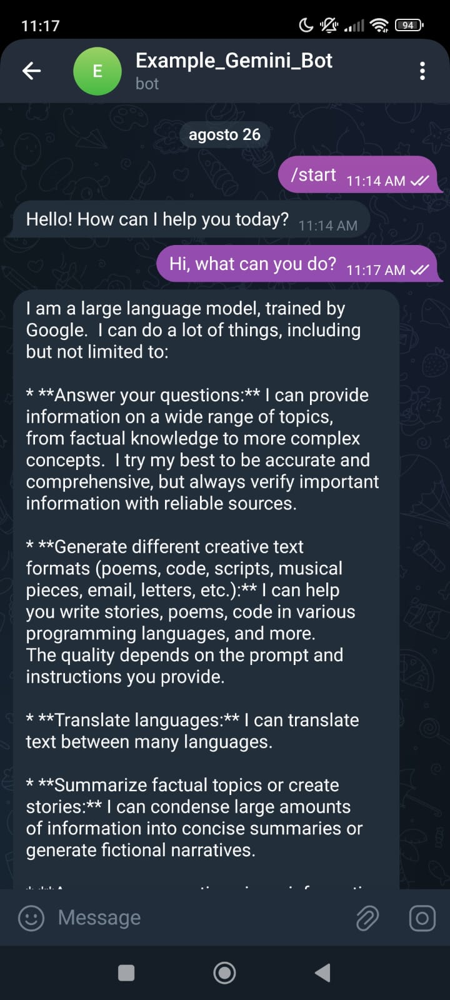

# bot_telegram_LLMs

A Telegram bot powered by Google Gemini LLM, built with Flask. The bot receives messages from Telegram users and responds using Gemini's generative AI.

## Demo



[Try the bot here](https://t.me/example_gemini_bot)

## Features

- Receives messages from Telegram users via webhook.
- Uses Google Gemini (via `google-generativeai`) to generate responses.
- Sends AI-generated replies back to users on Telegram.
- Simple Flask server for webhook handling.

## Requirements

See [requirements.txt](requirements.txt) for all dependencies.

- Python 3.8+
- Flask
- requests
- python-dotenv
- google-generativeai

## Setup

1. **Clone the repository** and install dependencies:

    ```sh
    pip install -r requirements.txt
    ```

2. **Create a `.env` file** in the project root with the following variables:

    ```
    GEMINI_API_KEY=your_gemini_api_key
    TELEGRAM_BOT_TOKEN=your_telegram_bot_token
    ```

3. **Set up your Telegram bot webhook** to point to your server's public URL.

4. **Run the bot:**

    ```sh
    python main.py
    ```

## Deployment Steps

1. **Create free accounts** on [Google AI](https://ai.google.dev/), [AWS](https://aws.amazon.com/), and [Ngrok](https://ngrok.com/).
2. **Create a Flask App** (already provided in this repository).
3. **Create an EC2 instance** on AWS.
4. **SSH into your EC2 instance** and clone this repository:

    ```sh
    git clone https://github.com/yourusername/bot_telegram_LLMs.git
    cd bot_telegram_LLMs
    ```

5. **Create a Telegram bot** using [BotFather](https://t.me/botfather) and obtain the API Token.
6. **Set your environment variables** in a `.env` file (do not use static values in code):

    ```
    GEMINI_API_KEY=your_gemini_api_key
    TELEGRAM_BOT_TOKEN=your_telegram_bot_token
    ```

7. **Run the Flask script** on the EC2 instance:

    ```sh
    python main.py
    ```

8. **Open a second terminal** and use Ngrok to create a tunnel on port 5000:

    ```sh
    ngrok http 5000
    ```

9. **Set up a webhook** for Telegram using the Ngrok HTTPS URL:

    ```sh
    curl -F "url=https://<your-ngrok-url>/" https://api.telegram.org/bot<YOUR_TELEGRAM_BOT_TOKEN>/setWebhook
    ```

10. **Test your bot** by sending messages to it on Telegram.

## Files

- `main.py`: Flask server handling Telegram webhook and Gemini integration.
- `gem.py`: Simple script to test Gemini API.
- `requirements.txt`: Python dependencies.

## License

MIT License. See [LICENSE](LICENSE)
